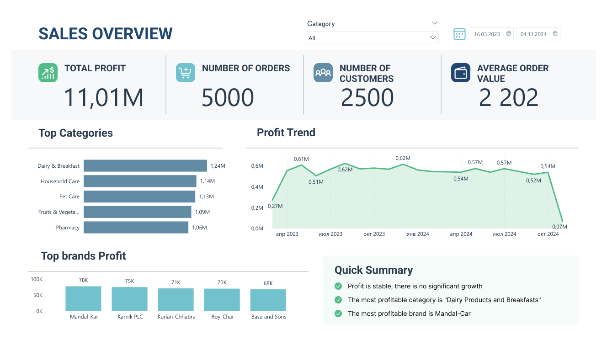
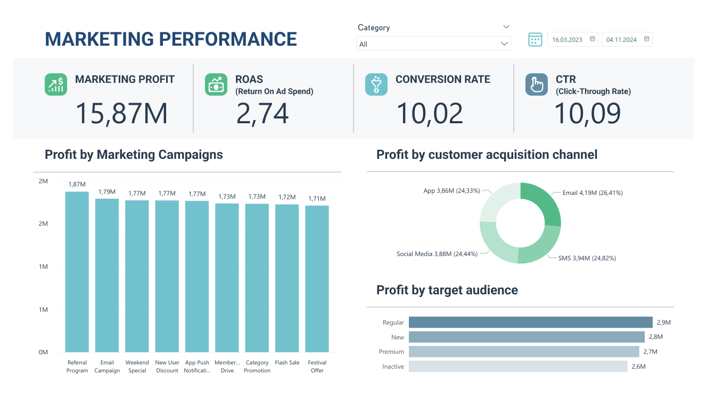
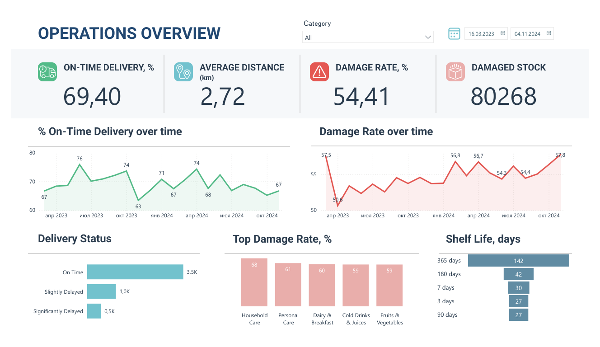

# Online Supermarket Sales Analysis

This project analyzes sales, marketing performance and operational processes of an online supermarket. The dataset is taken from Kaggle.

Review the SQL Script: **[HERE](https://github.com/Ekaterina-Kut/Data-Analyst-Portfolio/blob/main/Blinkit_analysis.sql)**.
## 🛠️ Tools

- **SQL**: for data exploration, data quality checks, and analysis.
- **Power BI**: for interactive dashboards and visualizations.

## 📈 Visualisations
- Sales Overview 
- Marketing Performance 
- Operations Overview 

## 📝 Key conclusions

- Revenue has remained stable with slight growth over time.
- Marketing investments appear to be effective regardless of campaign type, target audience, or acquisition channel.
- The conversion rate ranges from 9.5% to 10.5%, indicating stable efficiency at the stage of transition from click to target action.
- High percentage of late deliveries.
- Some inconsistencies in the data are likely due to the dataset being synthetic or randomly generated rather than reflecting real-world behavior.

## 🧾 Recommendations
- Improve data quality related to registration dates and user segmentation.
- Conduct a deeper analysis of delivery delays or revise estimated delivery times.
- Further analyze the cost structure of marketing campaigns and determine whether the results are driven by actual efficiency or by the volume of investment.
- In inventory analysis, review the methodology for calculating the damage indicator, verify the accuracy of data aggregation, and examine the source records for duplicate entries.

