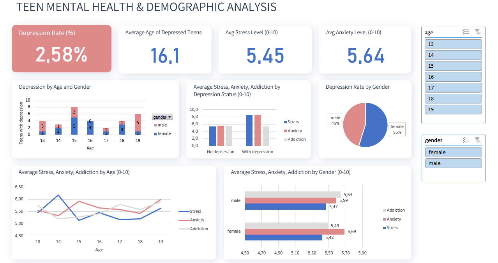
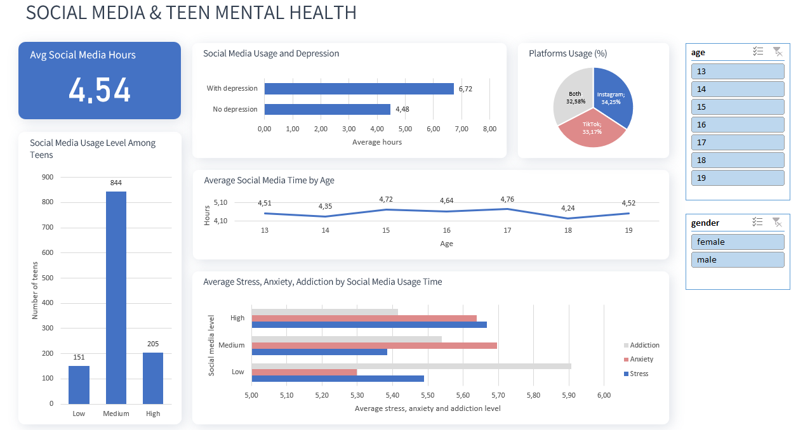
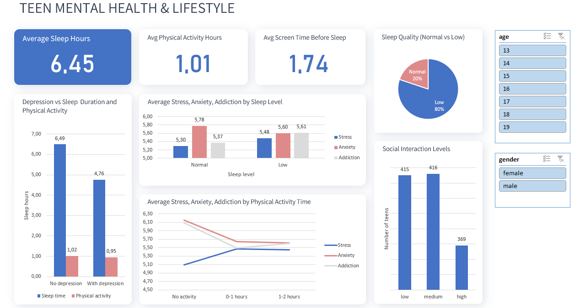

# Teen Mental Health Analysis

This project presents a set of dashboards that visualize potential relationships between lifestyle factors, such as sleep quality, social media usage, and physical activity, and adolescent mental health.

Mental health indicators include depression status as well as stress, anxiety, and addiction levels measured on a scale from 1 to 10.

The dashboards are intended for exploratory data analysis and visualization. They highlight patterns and potential associations within the dataset but do not establish causation or statistically significant relationships.

View the Excel file: **[HERE](https://github.com/Ekaterina-Kut/Data-Analyst-Portfolio/blob/main/Teen-Mental-Health_Excel/Teen_Mental_Health.xlsx)**.
## 🛠️ Tools

- **MS Excel**: for data cleaning, preparation, pivot tables, charts, and dashboard creation.

## Data Preparation

- Checked the dataset for duplicate rows.
- Converted selected columns to numeric data types.
- Created the sleep_level, activity_brackets, and social_media_level categories using the IF function.

## Dataset

Source: Kaggle (Teen Mental Health Dataset)

The dataset contains information about adolescents, including demographic characteristics, social media usage, sleep habits, physical activity, academic performance, and mental health indicators.

## 📈 Dashboards
- Teen Mental Health and Demographic 
- Social Media and Teen Mental Health 
- Teen Mental Health and Lifestyle 
